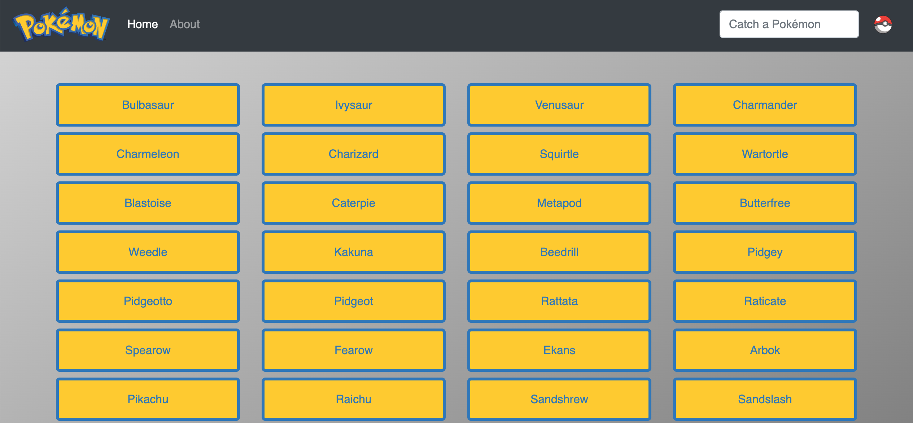

---

# App description:

This is a simple JavaScript App that shows 150 Pokémons on a single page.
User will then be able to click on a Pokémon name to see details such as its name, height, image and types.
A search bar also allows the User to find a specific Pokémon by name.

# Technologies used and App dependencies:

- HTML
- CSS
- JavaScript
- Bootstrap
- jQuery

# API used:

- PokéApi

# Link to webpage:

https://xavsln.github.io/pokedex-js-app_v20220524-1/
